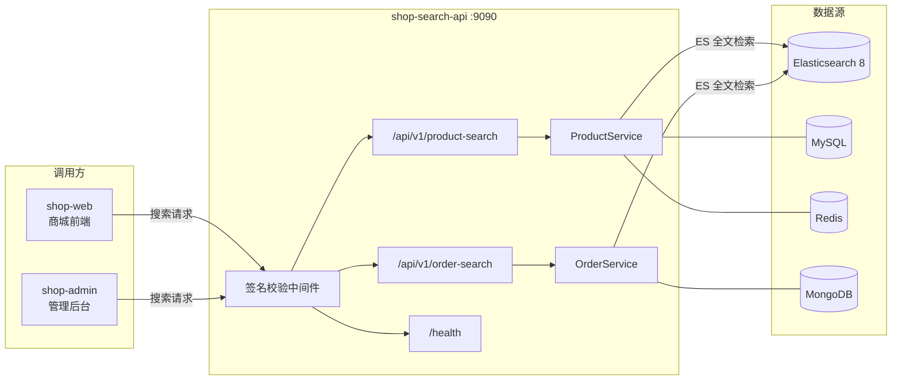

<div align="center">

# shop-search-api

**Go-Search 搜索 API 微服务 — 基于 Elasticsearch 8 的高性能商品与订单搜索接口**

[](https://golang.org)     [](https://www.elastic.co)     [](https://gin-gonic.com)     [](https://www.mysql.com)     [](https://redis.io)     [](LICENSE)

</div>

---

> `shop-search-api` 是 [Go-Search](https://github.com/HeRedBo/go-search) 项目的搜索 API 微服务，基于 `Gin + Elasticsearch 8 + MySQL + Redis + MongoDB` 构建，提供高性能的商品搜索与订单搜索 RESTful 接口。
> 服务集成 [pkg](https://github.com/HeRedBo/pkg) 基础设施库，统一管理多数据源连接，并支持 ES 查询日志、慢查询追踪与优雅关闭（ShutdownHook）。

---

## ✨ 服务亮点

<table>
<tr>
<td width="50%">

#### 🔍 ES8 高性能搜索
基于 Elasticsearch 8 构建商品/订单搜索，支持关键词全文检索、分类筛选、多维排序与分页

</td>
<td width="50%">

#### 🔑 接口签名校验
中间件层集成 AK/SK 签名校验，确保搜索接口安全性，防止未授权调用

</td>
</tr>
<tr>
<td>

#### 📋 ES 查询日志
启用 `WithQueryLogEnable(true)` 记录每次 ES 请求，支持慢查询追踪，便于性能调优

</td>
<td>

#### 🛑 优雅关闭
ShutdownHook 信号监听，按序关闭 HTTP Server → ES → MySQL → Redis → MongoDB → 日志 Flush

</td>
</tr>
<tr>
<td>

#### 🏗️ 分层架构
Router → Handler → Service → Repo 标准四层结构，职责清晰，易于扩展

</td>
<td>

#### 🔌 多数据源集成
ES8 / MySQL / Redis / MongoDB 四类数据源统一初始化，pkg 组件库按需引入

</td>
</tr>
</table>

---

## 🏗️ 系统架构



| 层级 | 说明 |
| :--- | :--- |
| **中间件层** | 接口签名校验（AK/SK HMAC），拦截非法请求 |
| **路由层** | Gin 路由注册，`/api/v1/*` 统一版本前缀 |
| **Handler 层** | 参数绑定与校验，统一响应格式封装 |
| **Service 层** | 业务逻辑，构造 ES DSL 查询条件 |
| **Repo 层** | 数据访问，ES 查询 / MySQL 关联 / Redis 缓存 |

---

## 📡 API 接口

| 方法 | 路径 | 说明 |
| :--- | :--- | :--- |
| `GET` | `/api/v1/product-search` | 商品搜索（关键词、分类、排序、分页） |
| `GET` | `/api/v1/order-search` | 订单搜索（订单号、商品名、状态筛选） |
| `HEAD` | `/health` | 健康检查 |

---

## 🧩 项目结构

```
shop-search-api/
├── config/                         # 配置管理
│   ├── config.yml                  #   主配置文件（端口/数据库/ES/Redis）
│   ├── config.go                   #   Viper 配置解析
│   └── constant.go                 #   常量定义
├── global/                         # 全局变量（DB / CACHE / ES / LOG / Mongo）
├── internal/                       # 业务核心代码
│   ├── pkg/                        #   内部工具包
│   ├── repo/                       #   数据访问层（ES 查询 / MySQL）
│   ├── server/                     #   服务入口
│   │   ├── api/                    #     路由与 Handler
│   │   │   ├── v1/                 #       V1 版本接口
│   │   │   │   ├── product_search.go  #   商品搜索 Handler
│   │   │   │   └── order_search.go    #   订单搜索 Handler
│   │   │   ├── api_response/       #     统一响应封装
│   │   │   ├── health.go           #     健康检查
│   │   │   └── router.go           #     路由注册
│   │   └── middleware/             #     中间件（接口签名校验）
│   └── service/                    #   业务逻辑层
│       ├── auth_service/           #     签名认证服务
│       ├── product_service/        #     商品搜索服务
│       └── order_service/          #     订单搜索服务
├── logs/                           # 日志存放目录
├── sql/                            # SQL 初始化脚本
├── go.mod
└── main.go                         # 入口（初始化 + HTTP Server + 优雅关闭）
```

---

## 🛠️ 技术栈

<table>
<thead>
<tr><th>分类</th><th>技术</th><th>用途</th></tr>
</thead>
<tbody>
<tr>
<td>语言</td>
<td></td>
<td>开发语言</td>
</tr>
<tr>
<td>Web 框架</td>
<td></td>
<td>HTTP 路由、参数绑定、中间件链</td>
</tr>
<tr>
<td>搜索引擎</td>
<td></td>
<td>商品/订单全文检索、聚合、排序，ES8 HTTPS 连接</td>
</tr>
<tr>
<td>数据库</td>
<td></td>
<td>业务数据查询，关联搜索结果</td>
</tr>
<tr>
<td>缓存</td>
<td></td>
<td>热点数据缓存，连接池管理</td>
</tr>
<tr>
<td>文档数据库</td>
<td></td>
<td>扩展数据存储（可选）</td>
</tr>
<tr>
<td>日志</td>
<td></td>
<td>结构化日志，文件轮转，ES 查询日志</td>
</tr>
<tr>
<td>配置</td>
<td></td>
<td>YAML 配置解析，多环境支持</td>
</tr>
<tr>
<td>优雅关闭</td>
<td></td>
<td>ShutdownHook 信号监听，多资源按序关闭</td>
</tr>
</tbody>
</table>

---

## 🚀 快速开始

### 环境要求

<table>
<thead>
<tr><th>依赖</th><th>版本</th><th>说明</th></tr>
</thead>
<tbody>
<tr>
<td></td>
<td>>= 1.23</td><td>开发语言</td>
</tr>
<tr>
<td></td>
<td>8.x</td><td>搜索引擎，必须</td>
</tr>
<tr>
<td></td>
<td>>= 5.7</td><td>关系型数据库，必须</td>
</tr>
<tr>
<td></td>
<td>>= 4.0</td><td>缓存，必须</td>
</tr>
<tr>
<td></td>
<td>4.x+</td><td>文档数据库，可选</td>
</tr>
</tbody>
</table>

### 部署步骤

**① 获取项目**

```bash
git clone https://github.com/HeRedBo/shop-search-api.git
cd shop-search-api
go mod tidy
```

**② 修改配置**

编辑 `config/config.yml`，配置以下节点：

```yaml
app:
  http_port: 9090         # 服务端口
mysql:                    # MySQL 连接
redis:                    # Redis 连接
elasticsearch:            # ES8 连接（host / user / password）
mongodb:                  # MongoDB 连接（可选）
```


**④ 启动服务**

```bash
go run main.go
# 服务默认监听 :9090
```

**⑤ 验证服务**

```bash
# 健康检查
curl -I http://localhost:9090/health

# 商品搜索示例
curl "http://localhost:9090/api/v1/product-search?keyword=手机&page=1&limit=10"
```

---

## 🔗 关联项目

| 项目 | 说明 |
| :--- | :--- |
| [go-search](https://github.com/HeRedBo/go-search) | 项目总入口 |
| [pkg](https://github.com/HeRedBo/pkg) | 核心基础设施库 |
| [shop-main](https://github.com/HeRedBo/shop-main) | 核心业务微服务（数据来源） |
| [order-consumer](https://github.com/HeRedBo/order-consumer) | 订单数据同步消费者（写入 ES） |
| [product-consumer](https://github.com/HeRedBo/product-consumer) | 商品数据同步消费者（写入 ES） |

---

<div align="center">

**Apache-2.0** License

</div>
